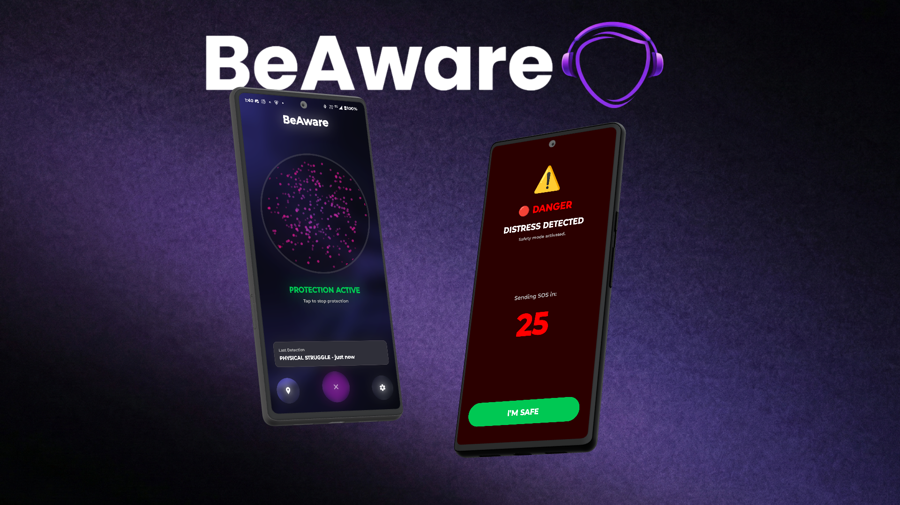

# BeAware 🛡️

**AI-Powered "Sixth Sense" for Pedestrians with Noise-Canceling Headphones**

BeAware, a native Android app using on-device pre-trained AI models to detect environmental dangers and alert users with noise canceling headphones or other hearing impairments. It hijacks the audio experience when it matters most without interfering with enjoyment.


---

## Problem

Noise-canceling headphones create a dangerous "audio bubble" that lowers awareness and makes it so that users may not be aware of their surroundings like:

- **Incomming emergency vehicles** 
- **Traffic hazards like honking or tire screeches**  
- **Threats to personal safety like shouting or fighting**
- **Bicycle bells and noises**

**Every year, pedestrians with headphones are involved in preventable accidents because they simply couldn't hear the danger approaching.**

---

## Our Solution - BeAware

### Core Features

| Urgency Level | Sounds Detected | Response |
|---------------|-----------------|----------|
| 🔴 **Level 1: Critical** | Screams, Shouts for Help, Physical Struggle, Glass Breaking, Gunshots | Music stops, continuous alert beeping (30 seconds), repeating vibration, full-screen alarm that wakes phone even when locked. 30-second countdown to emergency SMS if user doesn't tap "I'm Safe" |
| 🟡 **Level 2: Caution** | Sirens, Car Horns, Vehicle Alarms, Emergency Vehicles | Music lowers to 10%, double ping sound, Voice announcement according to the detected sound ("An ambulance is coming"), volume restores after 5 seconds. |
| 🟢 **Level 3: Awareness** | Bicycle Bells, Chimes, Bus Sounds, Dog Barking, Footsteps | Soft ping sound. Voice announcement only for bells/chimes ("A bike is coming") with volume at 10% for 5 seconds. All other sounds just play ping. |

### Emergency Features
- **Automatic SMS** — Level 1 critical alerts send the location to emergency contact if "I'm Safe" isn't pressed within 30 seconds
- **Full-Screen Alarm** — Level 1 alerts wake the phone screen even when locked, like an alarm clock
- **Location Sharing** — GPS coordinates are included in emergency SMS
- **Music Resume** — Music automatically resumes after alerts are dismissed

### Voice Announcement and Quality of Life
- **Customizable Categories** — The user can enable/disable Voice announcements for specific sound types in Settings:
  - **Bells/Bikes** — "A bike is coming"
  - **Sirens/Emergencies** — "An ambulance is coming"
  - **Vehicles** — "A bus is arriving", "A train is approaching"
  - **General Awareness** — "Dog nearby", "Footsteps nearby", etc.
- **Smart Volume Control** — Music automatically lowers to 10% during Voice announcements, then restores after 5 seconds
- **Headphone Optimized** — Voice announcements play through music stream for clear audio through headphones

### Users remain informed using the Danger Zone Map
- **Community Safety Map** — Users can view anonymous Level 1 critical alert locations on an interactive map
- **OpenStreetMap Integration** — No API keys required and works offline
- **Visual Indicators** — Red markers and danger zones show where critical incidents were detected

---

## Innovation

### What Makes BeAware Different

1. **100% On-Device AI** — No cloud processing. Your audio never leaves your phone. Zero latency, maximum privacy.

2. **Intelligent Urgency Routing** — Not all sounds deserve the same response. A bicycle bell gets a soft ping with optional TTS; a siren gets volume ducking and TTS; screaming gets full alarm takeover.

3. **Smart TTS System** — Customizable voice announcements that only trigger for enabled categories, with automatic volume management.

4. **Audio Hijacking** — Uses Android's AudioFocus API to *pause* or *duck* other apps (Spotify, YouTube, etc.) rather than just playing over them. Music automatically resumes after alerts.

5. **Optimized Audio Processing** — 960ms audio chunks (YAMNet's optimal window), UNPROCESSED microphone source for better detection range, priority filtering to ignore speech/silence when critical sounds are detected.

6. **Alarm-Style Critical Alerts** — Level 1 alerts wake your phone screen even when locked, ensuring you never miss a critical danger.

---

## Impact & Feasibility

### Who Benefits

- **Urban Pedestrians** — Commuters walking through busy city streets
- **Runners & Joggers** — Athletes exercising outdoors with music
- **Cyclists** — Riders who use bone-conduction or traditional headphones
- **Late-Night Walkers** — Anyone navigating potentially unsafe areas after dark

### Real-World Application

- **Estimated Market** — 300M+ noise-canceling headphone users globally
- **Zero Infrastructure Required** — Works with any Android phone, any headphones
- **No Subscription Model** — Free to use, privacy-first design

### Expansion Potential

- Smartwatch companion app with haptic alerts
- Integration with smart hearing aids
- Custom sound training for specific environments (construction sites, factories)

---

## Technical Implementation

### Key Technical Choices

| Component | Technology | Rationale |
|-----------|------------|-----------|
| **Platform** | Native Android (Kotlin) | Direct hardware access for low-latency audio |
| **AI Model** | YAMNet via MediaPipe | 521 sound classes, optimized for mobile, runs in ~50ms |
| **Audio Capture** | AudioRecord API @ 16kHz, UNPROCESSED source | Matches YAMNet requirements, 960ms chunks for optimal accuracy, raw audio for better range |
| **Media Control** | AudioFocus API | System-level integration to pause/duck other apps, automatic music resume |
| **Text-to-Speech** | Android TTS Engine | Customizable voice announcements with volume ducking |
| **Background Processing** | Foreground Service | Ensures continuous monitoring even when screen locked |
| **Mapping** | OSMDroid (OpenStreetMap) | Offline-capable maps for danger zone visualization, no API keys required |
| **UI Effects** | BlurView, Custom Views | Glass/blur effects, 3D particle audio visualizer, liquid blur overlay |

### Main Challenges Solved

1. **Real-time Classification** — Achieved <500ms detection-to-alert latency using optimized TFLite inference with 960ms audio chunks
2. **Battery Efficiency** — Foreground service with efficient audio buffering keeps drain under 5%/hour
3. **False Positive Reduction** — Priority filtering ignores speech/silence when critical sounds detected, confidence thresholds per category (0.25 for sirens, 0.60 for speech)
4. **Lock Screen Alerts** — Full-screen intent notifications with WAKE_LOCK to wake phone like an alarm, even when locked
5. **Audio Range** — UNPROCESSED microphone source disables automatic gain control and noise suppression, increasing detection range from ~5m to ~15m+
6. **TTS Volume Management** — Automatic volume ducking to 10% during announcements, restoration after 5 seconds, works even when screen is off

### Overall Functionality

```
┌─────────────────────────────────────────────────────────────┐
│                        BeAware Flow                         │
├─────────────────────────────────────────────────────────────┤
│                                                             │
│  📱 Phone Microphone                                        │
│         │                                                   │
│         ▼                                                   │
│  🎙️ AudioRecord (16kHz, 960ms chunks, UNPROCESSED source)  │
│         │                                                   │
│         ▼                                                   │
│  🧠 YAMNet Classification (on-device)                       │
│         │                                                   │
│         ▼                                                   │
│  🎯 Priority Filter + Urgency Mapper (521 classes → 3 levels)│
│         │                                                   │
│    ┌────┴────┬────────────┐                                 │
│    ▼         ▼            ▼                                 │
│  🔴 L1    🟡 L2       🟢 L3                                  │
│  STOP    Duck 10%    Ping                                  │
│  + Beep  + Ping      + TTS (bells only)                    │
│  + Vib   + TTS       + Duck 10% (bells only)                │
│  + Alarm (sirens)    + Restore 5s                           │
│  + SMS   + Restore 5s                                       │
│  (30s)   (NO vib)    (NO vib)                              │
│                                                             │
└─────────────────────────────────────────────────────────────┘
```

---

## Technologies Used

| Category | Technologies |
|----------|--------------|
| **Language** | Kotlin |
| **Platform** | Android SDK 26+ (Android 8.0 Oreo) |
| **AI/ML** | TensorFlow Lite, Google MediaPipe Audio Classifier, YAMNet |
| **Audio** | AudioRecord API, AudioManager, ToneGenerator, TextToSpeech |
| **Location** | Google Play Services FusedLocationProviderClient |
| **Communication** | Android SmsManager |
| **UI** | Material Design 3, ConstraintLayout, Custom Views (ParticleVisualizerView, LiquidOverlayView) |
| **Maps** | OSMDroid (OpenStreetMap) |
| **Effects** | BlurView library for glass/blur effects |
| **Background** | Android Foreground Service |

---

## Demo

### Screenshots

*Coming soon — screenshots of Home Screen, Alert Overlay, and Settings*

| Home Screen | Alert Overlay | Settings |
|-------------|---------------|----------|
|  |  |  |

### Demo Video

🎬 **[Watch Demo Video](#)** *(link coming soon)*

### Live Demo

To test BeAware:
1. Install the APK on an Android 8.0+ device
2. Grant microphone, SMS, location, and notification permissions
3. Set your emergency contact in Settings
4. Configure TTS preferences (enable/disable categories)
5. Tap the power button (center) to activate protection
6. Test alerts:
   - **Level 1**: Play screaming/shouting sounds → Full alarm with continuous beeping
   - **Level 2**: Play siren sounds → Double ping + "An ambulance is coming" (volume at 10%)
   - **Level 3**: Play bell/chime sounds → "A bike is coming" (volume at 10%)
7. View danger zones on the map (left button)

---

## Installation

```bash
# Clone the repository
git clone https://github.com/trajnovd/BeAware.git

# Open in Android Studio
# Build → Make Project

# Or build via command line
./gradlew assembleDebug

# Install on connected device
./gradlew installDebug
```

---

## Project Structure

```
BeAware/
├── app/src/main/
│   ├── java/com/beaware/app/
│   │   ├── service/        # AudioClassifierService - Foreground service for continuous monitoring
│   │   ├── audio/          # AudioClassifier, SoundClassification, UrgencyLevel
│   │   ├── alert/          # AlertManager - TTS, vibration, audio focus, volume control
│   │   ├── ui/             # MainActivity, SettingsActivity, MapActivity, AlertOverlayActivity
│   │   │                   # ParticleVisualizerView, LiquidOverlayView
│   │   └── data/           # PreferencesManager - User settings and TTS preferences
│   ├── res/                # Layouts, colors, strings, drawables, themes
│   └── assets/             # yamnet.tflite model
├── tasks/                  # PRD and task tracking
└── README.md
```


